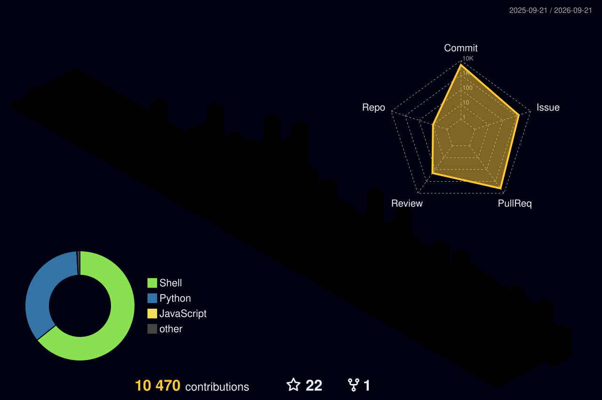

# 👋 Hi, I'm Abhi Mehrotra

I'm an undergraduate researcher in **Coastal Environmental Science + Data Science** at LSU (Expected 2028), focused on building practical tools at the intersection of **research analytics, Python engineering, and automation**.

<!-- Hosted cards: github-stats-extended.vercel.app -->

  <picture>
    <source
      media="(prefers-color-scheme: dark)"
      srcset="https://github-stats-extended.vercel.app/api?username=abhimehro&show_icons=true&include_all_commits=true&hide_border=true&border_radius=12&title_color=7DD3FC&icon_color=2DD4BF&text_color=CBD5E1&bg_color=0B1C2C&ring_color=38BDF8&show=reviews,prs_merged,prs_merged_percentage&custom_title=Abhi%20%C2%B7%20Coastal%20%26%20Data%20Systems&rank_icon=percentile&number_format=short"
    />
    
  </picture>

## 🔍 Current Technical Focus

- **Data science for environmental research:** sensor-data processing, time-series correction, and reproducible analysis pipelines
- **AI + automation:** workflow automation for operational monitoring and triage
- **Security-first engineering:** threat detection and self-hosted tooling for safer systems
- **Performance + reliability:** maintainable scripts and pipelines designed for real-world use
- **User-centric design:** documentation and workflows that are accessible to collaborators across disciplines

## 📁 Featured Projects

### Research systems

<!-- Long research repo names get full-width pins so titles are not truncated. -->

  

  

### Automation & ops

<!-- Shorter names pair cleanly side-by-side. -->

  
  

### Data Science & Research Systems

- [Hydrograph_Versus_Seatek_Sensors_Project](https://github.com/abhimehro/Hydrograph_Versus_Seatek_Sensors_Project)  
  Python analysis linking hydrograph and Seatek sensor data to study sediment bed-level dynamics and river morphology.
- [series_correction_project_updated](https://github.com/abhimehro/series_correction_project_updated)  
  Python tooling to detect and correct jumps, gaps, and outliers in time-series sensor data for cleaner downstream analysis.
- [Seatek_Analysis](https://github.com/abhimehro/Seatek_Analysis)  
  Research-oriented analysis tier supporting Seatek processing and workbook generation within a broader multi-stage workflow.

### Python Automation, Security, and Operations

- [email-security-pipeline](https://github.com/abhimehro/email-security-pipeline)  
  A self-hosted, containerized Python system for multi-layer suspicious-email analysis and automation-driven security triage.
- [personal-config](https://github.com/abhimehro/personal-config)  
  Scripted setup and documentation for secure, repeatable macOS development workflows.
- [system-maintenance-scripts](https://github.com/abhimehro/system-maintenance-scripts)  
  Automated maintenance scripts with scheduling and environment-aware execution for reliable daily operations.

### Languages in the stack

  <picture>
    <source
      media="(prefers-color-scheme: dark)"
      srcset="https://github-stats-extended.vercel.app/api/top-langs/?username=abhimehro&layout=compact&langs_count=8&card_width=320&hide_border=true&border_radius=12&title_color=7DD3FC&text_color=CBD5E1&bg_color=0B1C2C&custom_title=Stack%20%C2%B7%20Research%20%26%20Automation&size_weight=0.5&count_weight=0.5"
    />
    
  </picture>

## 🤝 How I Collaborate

- Build from clearly scoped, issue-driven tasks
- Prioritize readable code, reproducibility, and practical documentation
- Optimize for maintainability so teammates and future contributors can move quickly and safely

## 🧰 Skills

- **Languages:** Python, R, JavaScript, Shell, C++, Java
- **Data & Research:** pandas, numpy, tidyverse, matplotlib, seaborn, ggplot2
- **Domains:** environmental sensing data, security tooling, workflow automation
- **Tools:** Git, GitHub, containerized workflows, macOS/Linux scripting

## 📫 Connect

- **LinkedIn:** [abhi-mehrotra](https://www.linkedin.com/in/abhi-mehrotra)
- **Instagram:** [@abhimehro](https://instagram.com/abhimehro)
- **X (Twitter):** [@abhimehro](https://x.com/abhimehro)
- **GitHub:** [github.com/abhimehro](https://github.com/abhimehro)
- **Email:** [abhimehro@pm.me](mailto:abhimehro@pm.me)

## 📈 Activity

  

  

---

## 🐍 Watch My Contributions Get Eaten!

---

## 📊 3D Contribution Graph

 

### Guiding line

> The greatest threat to our planet is the belief that someone else will save it.
>
> — Robert Swan

